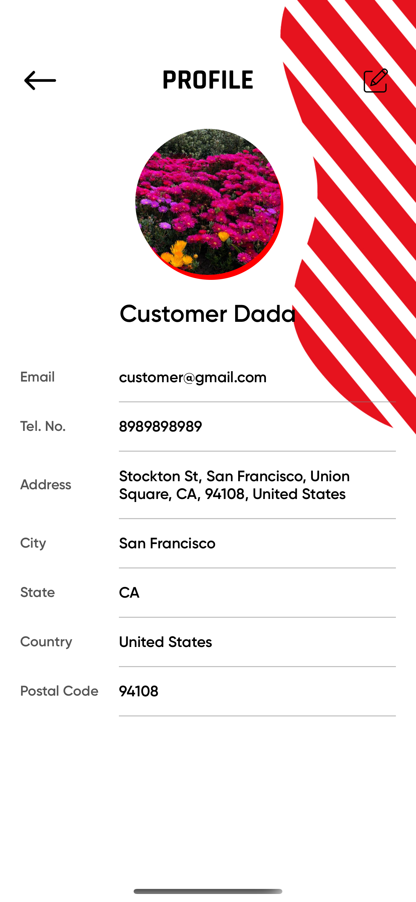
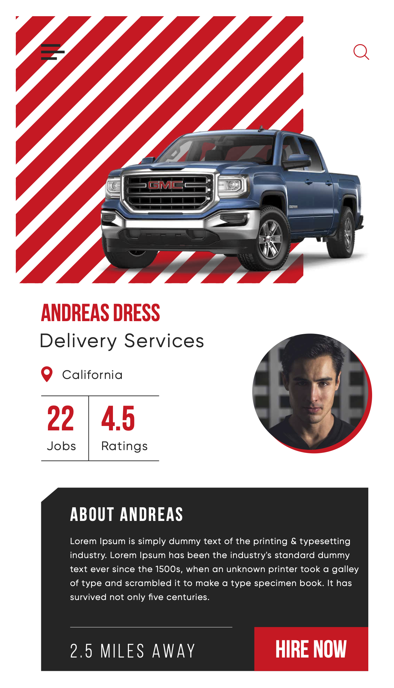
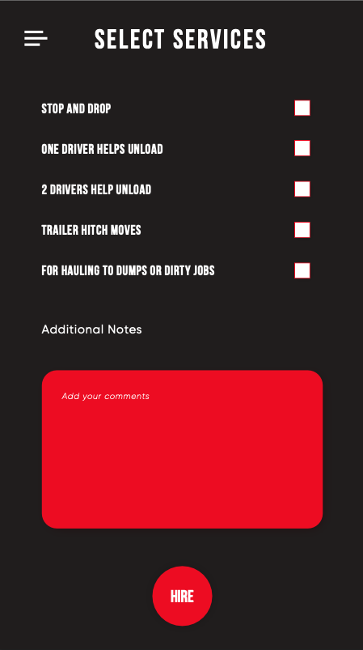

# Truc-Ya!! (Sample project repo)
An application that lets Truck drivers earn extra by allowing to provide services like Hauling, package delivery, etc


[![Swift Version][swift-image]][swift-url]
[![License][license-image]][license-url]
[](http://makeapullrequest.com)


<p align="center">





</p>


## Description
Truc-Ya is a free phone app that you download on your iPhone created by Steve Broda. It’s like Uber but for those truck owners that want to make extra cash full time or part-time doing pick up of packages and delivering. It also helps move people from point A to point B.

Clients will be anyone who needs something moved and needs it done right away or make an appointment. Truc-Ya will be utilized in the last mile delivery. Brick and mortar stores are closing and selling product via internet is getting huge.

## Features

* Hauling, Package Delivery, Live Tracking, Notifications 
* One app for both driver and customer
* State of the art interface UI


## Usage

### To enable proper functioning of the app, set your GCM key :
In `AppDelegate.swift` file, set the following:
```swift
    let gcmMessageIDKey = "{Your GCM message id key}"
```

## Requirements

- iOS 13.0+ 
- Xcode 12

## Installation

### Step 1:

Clone the repo. Open Terminal, go to directory where you want to clone the project, and run:
% `git pull <repo>`

### Step 2:

Install required Pods. Enter project directory and run:
% `pod install`
If the above command fails, then you may need to install cocoapods first.

### Step 3: 

Run the project


## Meta

### App Link
[https://apps.apple.com/us/app/truc-ya/id1489194536](https://apps.apple.com/in/app/truc-ya/id1489194536)

### Home Page
[https://www.trucya.com](https://www.trucya.com)

### Privacy Policy
[https://trucya.com/pages/privacy-policy.html](https://trucya.com/pages/privacy-policy.html)

### Repository
[https://github.com/anmolrajpal/TruckYa/tree/main/TruckYa](https://github.com/anmolrajpal/TruckYa/tree/main/TruckYa)

### Copyright
## 2024 Anmol Rajpal

## Developer

[@ArAnmol](https://twitter.com/ArAnmol)

[https://github.com/anmolrajpal](https://github.com/anmolrajpal)


[swift-image]:https://img.shields.io/badge/swift-5.0-orange.svg
[swift-url]: https://swift.org/
[license-image]: https://img.shields.io/badge/License-MIT-blue.svg
[license-url]: LICENSE.txt


